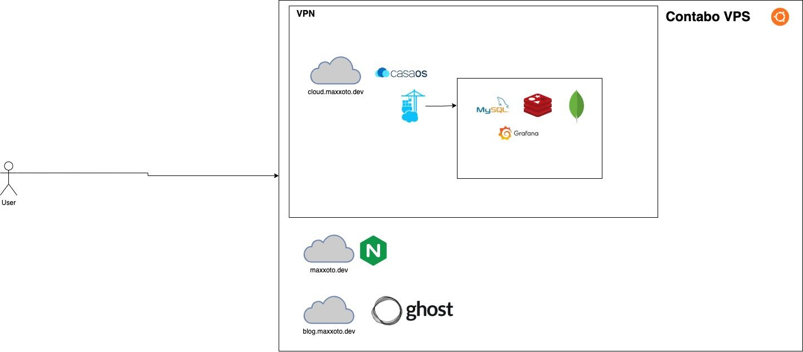

# 🌐 Personal Cloud Infrastructure

This repository outlines the architecture and configuration of my personal cloud infrastructure. It is designed to be **secure**, **scalable**, and **easy to manage** using **WireGuard** for secure access and **Portainer** for container orchestration.

---

## 🛠️ Overview

| Service | Description |
|---------|-------------|
| **OpenWebUI** | Personal LLM interface with custom memory and function support |
| **Ghost** | Blog platform with Markdown and media support |
| **Portainer** | GUI for managing Docker containers and services |
| **RabbitMQ** | Message broker for inter-service communication |
| **Databases** | Qdrant (vector), MongoDB (NoSQL), PostgreSQL (SQL), MySQL (SQL) |
| **WireGuard** | Secure, lightweight, and scalable network tunnel for internal communication |
| **QR Code Config** | Generate WireGuard client configurations via QR code for easy setup |

---

## 🌐 Access Policy

All services are **only accessible via WireGuard**, ensuring secure internal communication. Public access is **not allowed** unless explicitly configured through Docker-ufw and public IPs.

---

## 🔐 WireGuard Setup

### ✅ Secure Access

- **Only internal clients** can access services via WireGuard.
- **QR Code-based client setup** allows for easy onboarding of new devices.

### 🧪 Client Onboarding

1. Run the `generate-wg-qr.sh` script:
   ```bash
   ./generate-wg-qr.sh my-laptop
   ```
2. This will:
   - Generate a WireGuard client config with a unique IP.
   - Generate a QR code for easy mobile setup.

3. Scan the QR code with a WireGuard-compatible app on your device.

---

## 🧪 Testing Access

1. Connect to the WireGuard network using a client.
2. Access services via their internal IPs:
   - OpenWebUI: `http://10.24.0.1:3000`
   - Ghost: `http://10.24.0.2:2368`
   - Portainer: `http://10.24.0.3:9000`
   - RabbitMQ: `http://10.24.0.4:15672`
   - Qdrant: `http://10.24.0.5:6333`

---

## 📚 Additional Notes

- **Security**: Always use strong keys and limit access to only necessary IPs.
- **Scalability**: Add more peers in `wg0.conf` as needed.
- **Backup**: Regularly back up WireGuard configs and Docker volumes.

---

## 🌟 Roadmap

- Add TLS for WireGuard (optional)
- Integrate with cloud providers for dynamic IP handling
- Add metrics dashboard (e.g., Prometheus + Grafana)

---
